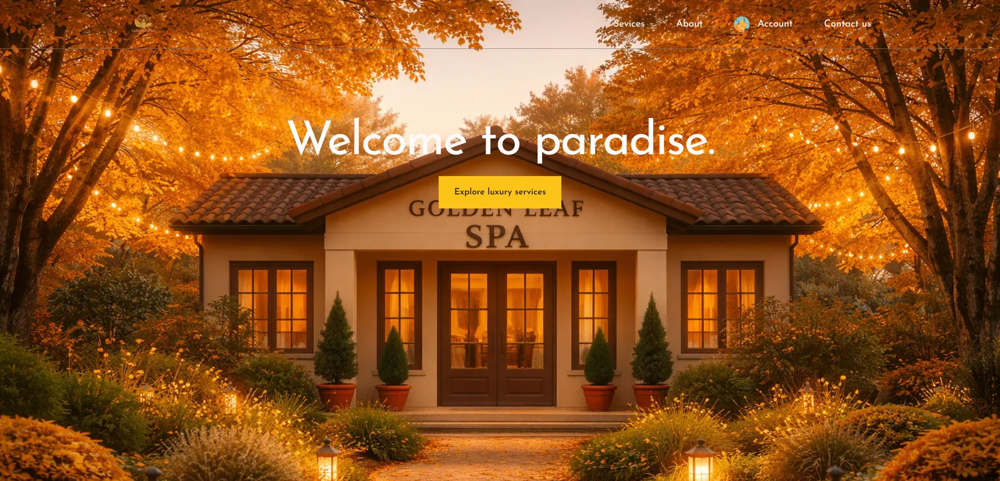
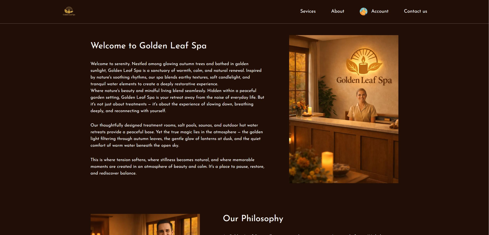
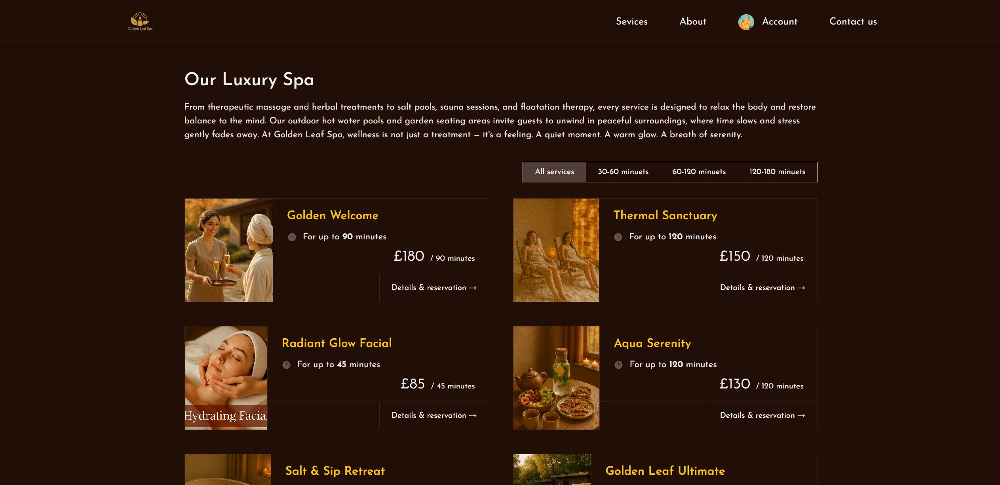
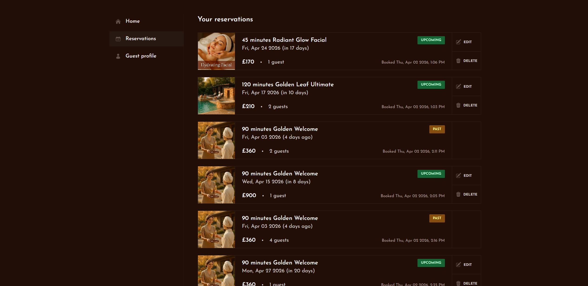
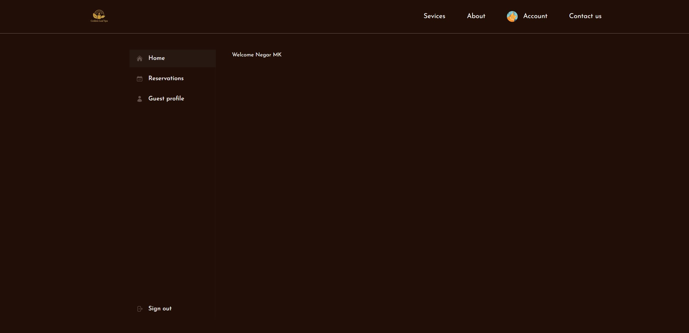
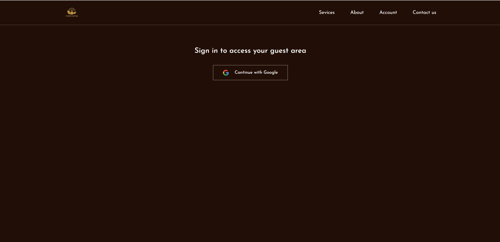
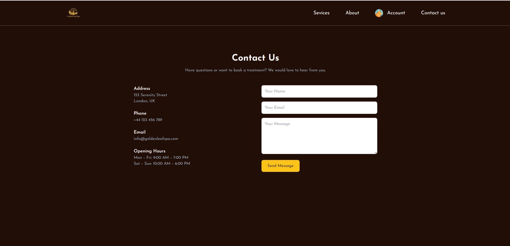

# 🌿 Golden Leaf Spa Web Application

A modern luxury spa booking website built with **Next.js**, offering a seamless experience for browsing services, managing reservations, and handling guest profiles.

---

## ✨ Overview

Golden Leaf Spa is a full-featured web application that allows users to:

- Explore spa services
- Make and manage reservations
- Update personal guest profiles
- Contact the spa
- Authenticate using Google

This project focuses on **clean UI/UX**, **real-world booking flow**, and **modern full-stack practices**.

---

## 🖼️ Application Screens



### 🏠 Welcome Page

- Elegant landing page with spa branding
- CTA button to explore services
- Warm, luxury-focused design

---

### 📖 About Page



- Introduces the spa philosophy
- Focus on calm, nature-inspired experience
- Helps build trust and brand identity

---

### 💆 Services Page



- Lists available spa services
- Includes duration and pricing
- Filter by time categories (30–60, 60–120, etc.)

---

### 📅 Reservations Dashboard



- Displays all bookings
- Shows:
  - Upcoming vs Past reservations
  - Price and number of guests
- Includes:
  - ✏️ Edit
  - 🗑 Delete actions

---

### 👤 Guest Profile

- Users can update:
  - Name
  - Email
  - Phone number
  - Preferences
- Improves check-in experience

---

### 🏠 Account Home



- Simple dashboard after login
- Personalized welcome message

---

### 🔐 Sign In Page



- Google authentication integration
- Fast and secure login experience

---

### 📩 Contact Page



- Displays:
  - Address
  - Phone
  - Email
  - Opening hours
- Includes contact form for user messages

---

## 🛠️ Tech Stack

- **Frontend:** Next.js (App Router)
- **Styling:** Tailwind CSS
- **Authentication:** Google OAuth
- **Backend:** API routes (Next.js)
- **Database:** Prisma ORM
- **Deployment:** (Add yours if deployed)

---

## 🚀 Getting Started

```bash
git clone https://github.com/Negar-Maleki/golden-leaf-spa-webpage.git
cd golden-leaf-spa-webpage
npm install
npm run dev
```
